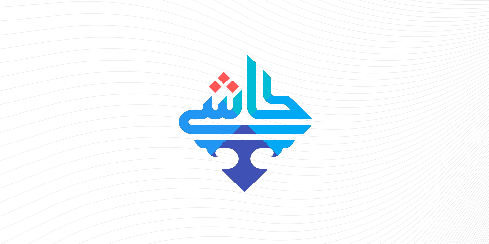

# Kāshi
A turing complete JSON-like declarative language for data/config description.

## Why?

Really out of curiosity, to see what happens with such a language if it is designed in a convenient enough manner.
I suspect that this language will be useful for configuration management on large scale systems with pretty complex
configuration. We also suspect it might be useful in data-analysis. Originally, it was designed as a language for Android UI description
(as part of Inline-Apps platform of [CafeBazaar](https://github.com/cafebazaar)), though it was later swapped for a custom XML-based
format for that particular platform.

### Inspiring Examples

- Simple config:
```js
{
  prod: true;
  root: $PWD + './dist';
  port: {
    $PORT | $PORT != undefined;
    3000  | otherwise;
  };
  middlewares: {
    '/users': { 'auth', 'admin' },
    '/profile': { 'auth' }, 
  },

  //
  // also some function-like configuration values
  //
  logFormat: {
    warning: [msg, time]: 'WARNING: ' + msg;
    error: [msg, time]: `ERROR ({time format['yy/MM/dd; hh:MM']}): ` + msg;
  };

  //
  // importing
  //
  format: formatDate @from['https://kaashi.dev/date.ka'];
}
```
<br>

- Data fetching / processing:
```js
{
  //
  // import useful functions
  //
  ops: @from['./array-operations.ka'];
  map: ops.map;
  filter: ops.filter;
  sum: ops.sum;

  mean[l]: sum[l] / l.length;

  //
  // import data
  //
  loadCSV: @from['https://kaashi.dev/csv.ka'];

  DATA: loadCSV['https://my.cluster.cloud/logs/cpu.csv'];
  NODES: loadCSV['https://my.clusetr.cloud/topology/nodes'];

  //
  // calculate stuff
  //
  overloadedNodes:
    NODES
    --> map[[node]: { node, DATA --> filter[[row]: row.id = node.id] --> mean }
    --> filter[[{node, mean}]: mean > $OVERLOAD_THRESHOLD]
    --> map[[{node}]: node]
  ;
}
```
<br>

More abstract examples to demonstrate syntactic capabilities:

- Factoriel function / dataset:

```js
{
  !: {
    0: 1;
    [n]: n * (n - 1)!
  }
}
```
<br>

- Fibbonacci sequence:

```js
{
  fib[1]: 1;
  fib[2]: 1;
  fib[n | (n is number) and (n > 2)]: fib[n - 1] + fib[n - 2];
}
```

Alternative definition:

```js
{
  fib[n | (n is number) and (n > 0)]: {
    1                         | n = 1;
    1                         | n = 2;
    fib[n - 1] + fib[n - 2]   | otherwise;
  }
}
```
<br>

- Array operations:

```js
// array-operations.ka
{
  /*
   * sum of all elements of an array
   */
  sum: {
    [{x, ...rest}]: x + sum[rest];                                // --> destructuring
    [{}]: 0;                                                      // --> so for empty array the value is zero
  };

  /*
   * mapping
   */
  map[F][l][i | (i is number) and (i < l.length)]: F[l[i], i];
  map[F][l]:: { length: l.length };                               // --> object extension

  /*
   * filtering
   */
  filter[F]: {
    [{x, ...rest}]: {
      { x, ...filter[F][rest] }  | x is F;                        // --> this is equivalent to `F[x]` or `x F` or `x --> F`
      filter[F][rest]            | otherwise;
    };

    [{}]: {};                                                     // --> empty array for empty array
  };

  /*
   * reduce function
   */
  reduce[F, I (default 0)]: {
    [{}]: I;
    [{x, ...rest}]: F[reduce[F, I][rest], x];
  };
}
```
<br>

- A geometric vector _type_:

```js
{
  sqrt: sqrt @from['https://some.server/math.ka'];
  { map: map, sum: sum }: @from['./array-operations.ka'];

  vec[N | N is number]
     [l | l.length = N]: {
    dimension: N;
    len: l --> map[[x]: x * x] --> sum --> sqrt;
    
    + [o | o.dimension = N]: l map[[x, i]: o[i] + x] --> vec[N];
    + :: this;

    - [o | o.dimension = N]: l map[[x, i]: o[i] - x] --> vec[N];
    - [i | i is number]: -l[i];
    - :: this;

    * [k | k is number]: l map[* k] --> vec[N];
    * [o | o.dimension = N]: l --> map[[x, i]: o[i] * x] --> sum;
    / [k | k is number]: this * (1 / k);
    ^ : l --> map[[x]: x / (len this)] --> vec[N];
  };

  vec[2][{x, y}]:: {x: x, y: y};
  vec[2][{x: x, y: y}]: vec[2][{x, y}];
}
```

<br>

- Operator overloading for achieving _function_ combination via standard mathematical syntax:

```js
// combinable.ka
{
  combinable: {
    o[F][x]: F[this[x]];
  }
}
```
```js
{
  F[X]: X + 3; // --> or any arbitrary function
  G[X]: X * 2; // --> or any arbitrary function

  F::combinable @from['./combinable.ka'];
  G::combinable @from['./combinable.ka'];

  H: F o G;     // --> H[X]: (3 * x) + 2;
}
```

<br><br>

## State of the Project

This project is in _idea_ stage, i.e. the basic idea is documented (the [inspiring examples](#inspiring-examples) above). The syntax needs to be properly documented (I have started on that front, though it takes some time to get cozy with ABNF), the semantics need to be properly documented afterwards, etc, but I feel these examples do outline enough of the idea to be able to move forward.

So if you have time and interest in helping with this project, all kinds of help/input is much appreciated. The main work that needs to be done is as follows:

- **Syntax Specification**\
  Currently ABNF is picked as specification format, open to discussion.

- **Semantic Specification**\
  No format / methodology chosen, open to discussion.

- **Reference Implementation**\
  A (not necessarily optimal) reference implementation would be greatly beneficial. Ideally this reference implementation should be written in JavaScript / TypeScript or in a manner compilable to WASM so that it allows easy implementation of a web-based playground.

- **Usable Implementation**\
  An implementation targeting a particular use case. What that use-case will be or in which environment / form the implementation will be (a standalone service/runtime, an integratable library targeting one or many specific languages, etc.) is open for discussion. The main aim of this particular endeavour is not necessarily to build a usable product out of the language but rather to further investigate necessary modifications / optimizations to syntax / semantics of Kāshi in a more realistic environment. Of course proper pursuit of that goal does entail somewhat trying to get a useful product out of it as well.

Since the project is in ideation stage, everything is open for discussion. Do not hesitate to open an issue for any form of question / feedback / etc. Also you can contact me on ghanizadeh.eugene@gmail.com.
  
